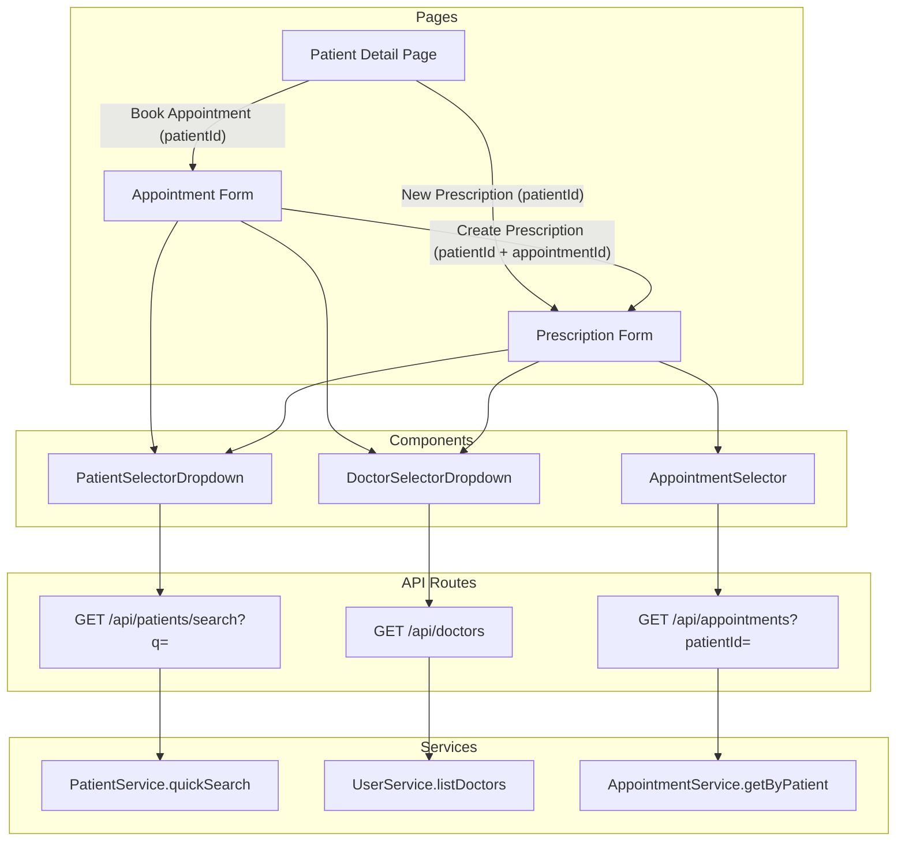

# Design Document: Clinical Workflow UX

## Overview

This design enhances the clinical workflow in the clinic SaaS platform by replacing manual ID entry with smart selectors, adding contextual action buttons, and providing seamless navigation between related forms. The changes span the Patient Detail Page, Appointment Form, Prescription Form, and their supporting API endpoints.

### Key Design Decisions

1. **Shared reusable components**: A single `PatientSelectorDropdown` and `DoctorSelectorDropdown` component serve both the Appointment and Prescription forms, configured via props (e.g., result limit).
2. **Dedicated search API endpoint**: A new `GET /api/patients/search` endpoint handles typeahead queries with OR-based matching across firstName, lastName, and phoneNumber — distinct from the existing `GET /api/patients` which uses AND-based multi-field search for the patient list page.
3. **Dedicated doctors API endpoint**: A new `GET /api/doctors` endpoint returns active doctors for the tenant, accessible by any authenticated user (not restricted to `user_management`).
4. **URL parameter pre-fill pattern**: Forms read `patientId` and `appointmentId` from URL search params to enable cross-page navigation with context.
5. **Client-side debounced search**: Patient typeahead uses 300ms debounce before calling the API, with a minimum 2-character threshold.

## Architecture



## Components and Interfaces

### 1. PatientSelectorDropdown

A reusable typeahead dropdown for searching and selecting patients.

```typescript
interface PatientSelectorDropdownProps {
  /** Currently selected patient ID */
  value: string | null;
  /** Callback when a patient is selected */
  onChange: (patient: { id: string; firstName: string; lastName: string } | null) => void;
  /** Maximum results to display (default: 20) */
  limit?: number;
  /** Whether the selector is locked (pre-filled from URL param) */
  disabled?: boolean;
  /** Display name when locked/pre-filled */
  displayName?: string;
  /** Error message to show (e.g., "Patient not found") */
  error?: string;
  /** Placeholder text */
  placeholder?: string;
}
```

**Behavior:**
- Shows a text input that triggers search on ≥2 characters typed
- Debounces input by 300ms before API call
- Calls `GET /api/patients/search?q={query}&limit={limit}`
- Displays dropdown with matching patients (name + phone)
- Shows "No patients found" when results are empty
- When `disabled=true`, renders as a read-only display showing `displayName`

### 2. DoctorSelectorDropdown

A dropdown that lists active doctors for the current tenant.

```typescript
interface DoctorSelectorDropdownProps {
  /** Currently selected doctor ID */
  value: string | null;
  /** Callback when a doctor is selected */
  onChange: (doctorId: string | null) => void;
  /** Auto-select this doctor ID on mount (for logged-in doctor) */
  autoSelectId?: string;
  /** Error message to show */
  error?: string;
}
```

**Behavior:**
- Fetches doctor list from `GET /api/doctors` on mount
- Displays all active doctors sorted alphabetically by name
- Auto-selects when only one doctor exists in the tenant
- Auto-selects `autoSelectId` if provided (logged-in doctor on prescription form)
- Shows error state if fetch fails or list is empty
- Disables form submission when no doctors are available

### 3. AppointmentSelector

A dropdown listing non-cancelled appointments for a patient.

```typescript
interface AppointmentSelectorProps {
  /** The selected patient's ID (null = disabled state) */
  patientId: string | null;
  /** Currently selected appointment ID */
  value: string | null;
  /** Callback when an appointment is selected */
  onChange: (appointmentId: string | null) => void;
  /** Pre-select this appointment ID from URL params */
  preSelectId?: string;
  /** Error message to show */
  error?: string;
}
```

**Behavior:**
- Disabled with "Select a patient first" placeholder when `patientId` is null
- Fetches appointments from `GET /api/appointments?patientId={id}&excludeCancelled=true`
- Displays appointments sorted by date descending, showing date + time + visit type
- Shows "No appointments found for this patient" when empty
- Pre-selects `preSelectId` if provided and valid for the patient
- Clears selection when `patientId` changes

### 4. API Endpoint: GET /api/patients/search

**Purpose:** Typeahead patient search using OR-based matching.

```typescript
// Query params
interface PatientSearchQuery {
  q: string;     // Search query (min 2 chars)
  limit?: number; // Max results (default 20, max 50)
}

// Response
interface PatientSearchResult {
  id: string;
  firstName: string;
  lastName: string;
  phoneNumber: string;
}
```

**Implementation:**
- Permission: `patient_management` (accessible to Admin, Doctor, Medical_Assistant)
- Searches with OR logic: `firstName ILIKE %q%` OR `lastName ILIKE %q%` OR `phoneNumber ILIKE %q%`
- Always scoped by `tenantId`
- Results ordered by `lastName ASC, firstName ASC`
- Limited to `limit` param (default 20, max 50)
- Returns minimal fields for display efficiency

### 5. API Endpoint: GET /api/doctors

**Purpose:** List all active doctors for the tenant.

```typescript
// Response item
interface DoctorListItem {
  id: string;
  name: string;
}
```

**Implementation:**
- Permission: `appointments` (accessible to Admin, Doctor, Medical_Assistant)
- Filters: `role = 'Doctor'` AND `isActive = true` AND `tenantId = current`
- Sorted alphabetically by `name`
- Returns only `id` and `name` for dropdown display

### 6. Updated Patient Detail Page Header

Adds action buttons to the existing page header:

```typescript
// Button visibility rules
const showBookAppointment = true; // Always visible (all roles have 'appointments' permission)
const showNewPrescription = userRole === 'Admin' || userRole === 'Doctor';
```

**Navigation targets:**
- "Book Appointment" → `/appointments/new?patientId={id}`
- "New Prescription" → `/prescriptions/new?patientId={id}`

### 7. Post-Appointment Success View

After successful appointment creation, shows a confirmation with optional "Create Prescription" link:

```typescript
// Link visibility
const showCreatePrescription = userRole === 'Admin' || userRole === 'Doctor';

// Link target
const prescriptionUrl = `/prescriptions/new?patientId=${appointment.patientId}&appointmentId=${appointment.id}`;
```

## Data Models

No new database tables are required. The feature leverages existing schema:

- **patients** — searched by `firstName`, `lastName`, `phoneNumber` (existing indexes support this)
- **users** — filtered by `role='Doctor'` and `isActive=true`
- **appointments** — filtered by `patientId` and `isCancelled=false`, ordered by `date DESC`

### New Service Functions

```typescript
// patient-service.ts
export interface QuickSearchResult {
  id: string;
  firstName: string;
  lastName: string;
  phoneNumber: string;
}

/**
 * OR-based patient search for typeahead.
 * Matches if query appears in firstName, lastName, OR phoneNumber.
 */
export async function quickSearch(
  tenantId: string,
  query: string,
  limit: number
): Promise<QuickSearchResult[]>;

// user-service.ts
export interface DoctorListResult {
  id: string;
  name: string;
}

/**
 * Lists active doctors for a tenant, sorted alphabetically.
 */
export async function listDoctors(
  tenantId: string
): Promise<DoctorListResult[]>;

// appointment-service.ts
/**
 * Returns non-cancelled appointments for a patient, sorted by date DESC.
 */
export async function getByPatient(
  tenantId: string,
  patientId: string
): Promise<AppointmentResult[]>;
```

## Correctness Properties

*A property is a characteristic or behavior that should hold true across all valid executions of a system — essentially, a formal statement about what the system should do. Properties serve as the bridge between human-readable specifications and machine-verifiable correctness guarantees.*

### Property 1: Patient search returns only matching results

*For any* set of patients in a tenant and any search query of 2+ characters, every patient returned by `quickSearch` SHALL have the query appearing as a case-insensitive substring in at least one of: firstName, lastName, or phoneNumber. Additionally, the number of results SHALL NOT exceed the specified limit.

**Validates: Requirements 2.2, 4.2**

### Property 2: Doctor list contains only active doctors

*For any* set of users in a tenant, the result of `listDoctors` SHALL contain exactly those users where `role = 'Doctor'` AND `isActive = true`, and no others.

**Validates: Requirements 3.1, 5.1**

### Property 3: Doctor list is sorted alphabetically

*For any* list of active doctors returned by `listDoctors`, the names SHALL be in ascending alphabetical order (case-insensitive).

**Validates: Requirements 3.2**

### Property 4: Single-doctor auto-selection

*For any* tenant with exactly one active doctor, the Doctor_Selector SHALL auto-select that doctor's ID as the value without user interaction.

**Validates: Requirements 3.3**

### Property 5: Logged-in doctor auto-selection on prescription form

*For any* user with role `Doctor`, when the Prescription_Form loads, the Doctor_Selector SHALL have the logged-in user's ID pre-selected as its initial value.

**Validates: Requirements 5.2**

### Property 6: Appointment filtering by patient excludes cancelled

*For any* set of appointments in a tenant and any selected patient, the Appointment_Selector SHALL display only those appointments where `patientId` matches the selected patient AND `isCancelled = false`, sorted by date in descending order.

**Validates: Requirements 6.1, 6.2**

### Property 7: Navigation URL parameter correctness

*For any* patient ID and optional appointment ID, the generated navigation URL SHALL contain query parameters whose values exactly match the source IDs, and parsing the URL's search params SHALL reconstruct the original IDs without loss.

**Validates: Requirements 1.4, 1.5, 7.2**

## Error Handling

| Scenario | Behavior |
|----------|----------|
| `patientId` URL param not found in tenant | Show inline error "Patient not found", disable form submission |
| `appointmentId` URL param not found or cancelled | Silently leave appointment selector unselected |
| Patient search API fails (network/500) | Show "Search unavailable" in dropdown, allow retry |
| Doctor list API fails | Show "Could not load doctors" error, disable form submission |
| Doctor list empty | Show "No doctors available" message, disable submission |
| No appointments for patient | Show "No appointments found for this patient" |
| Search query < 2 characters | Do not trigger API call, show hint text |

### Error Recovery Patterns

- **Retry on transient failures**: All API fetches in selector components include a retry mechanism (single retry after 1 second delay on network failures).
- **Graceful degradation**: If the patient search API fails, the user can still manually navigate to the correct patient by other means.
- **Validation on submission**: Server-side validation re-checks that referenced patient, doctor, and appointment IDs exist and belong to the current tenant before creating records.

## Testing Strategy

### Property-Based Tests (fast-check + vitest)

The following service functions have pure logic suitable for property-based testing:

1. **`quickSearch` filtering logic** — Test that results always match the query in at least one field
2. **`listDoctors` filtering logic** — Test that only active doctors are returned
3. **`listDoctors` sorting** — Test alphabetical ordering invariant
4. **`getByPatient` filtering** — Test that cancelled appointments are excluded and results are for the correct patient
5. **Appointment sort order** — Test descending date sort
6. **URL parameter construction** — Test round-trip: constructing and parsing URLs preserves IDs

**Configuration:**
- Library: `fast-check` (already in devDependencies)
- Runner: `vitest`
- Minimum iterations: 100 per property
- Tag format: `Feature: clinical-workflow-ux, Property {N}: {description}`

### Unit Tests (vitest)

- Component rendering tests for `PatientSelectorDropdown`, `DoctorSelectorDropdown`, `AppointmentSelector`
- Role-based button visibility on Patient Detail Page (Admin/Doctor see both buttons, Medical_Assistant sees only "Book Appointment")
- Pre-fill behavior when URL params are provided
- Error states (invalid ID, empty lists, API failures)
- Auto-select logic for single doctor and logged-in doctor
- Post-appointment success view shows/hides "Create Prescription" link based on role

### Integration Tests

- Full form submission flow with pre-filled params
- End-to-end navigation from Patient Detail → Appointment Form → Success → Prescription Form
- API endpoint response format validation
- Tenant isolation (search never returns patients from other tenants)
