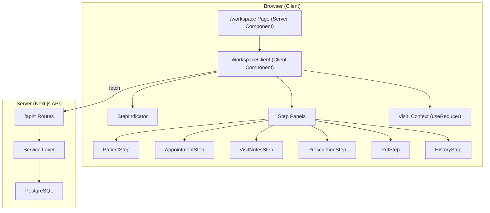
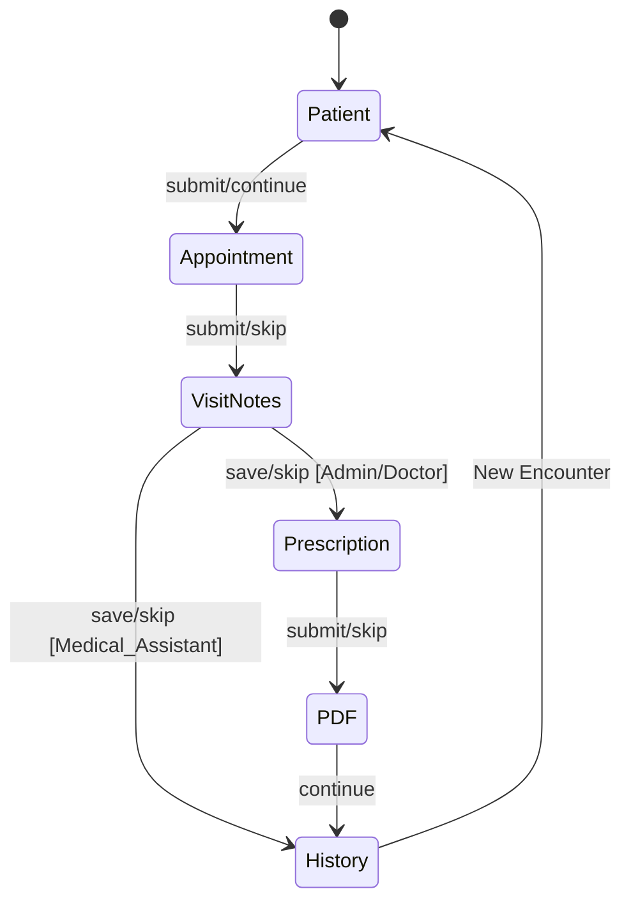
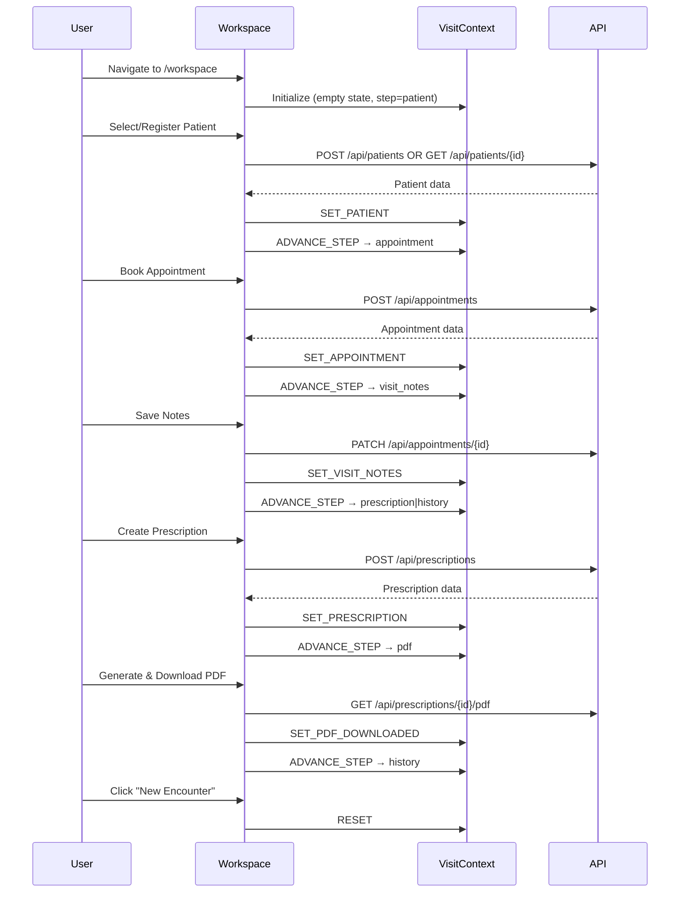

# Design Document: Unified Patient Workflow

## Overview

The Unified Patient Workflow is a single-page workspace (`/workspace` route) that consolidates the entire patient encounter into one view. It replaces the current multi-page navigation pattern (patient registration → appointment booking → visit notes → prescription creation → PDF export → visit history) with a sequential, step-based workflow that maintains in-memory state across all phases.

The workspace is implemented as a client-side React component using a state machine pattern for step transitions, a shared `Visit_Context` for cross-step data persistence, and role-based step visibility to enforce access control at the UI layer. All data operations flow through existing API endpoints and services, requiring no new database tables.

### Key Design Decisions

1. **In-memory state only**: Visit_Context lives in React state (useReducer). No localStorage or sessionStorage — refresh resets the workflow. This keeps the implementation simple and avoids stale-state bugs.
2. **Reuse existing components**: PatientSelectorDropdown, DoctorSelectorDropdown, AppointmentSelector, LoadingSpinner, NotificationToast, and RoleGate are reused directly.
3. **Step machine pattern**: A deterministic function computes the next step based on current step, user role, and action (advance/skip). This makes transitions testable without rendering.
4. **Existing API routes**: All data mutations (create patient, create appointment, update notes, create prescription, generate PDF) use the existing API endpoints. No new API routes are needed.

## Architecture

### High-Level Architecture



### Route Structure

```
src/app/(dashboard)/workspace/
├── page.tsx              # Server component: auth check, render WorkspaceClient
└── components/
    ├── WorkspaceClient.tsx    # Main client orchestrator
    ├── StepIndicator.tsx      # Step navigation bar
    ├── PatientStep.tsx        # Patient search/registration
    ├── AppointmentStep.tsx    # Appointment booking
    ├── VisitNotesStep.tsx     # Clinical notes
    ├── PrescriptionStep.tsx   # Medication prescription
    ├── PdfStep.tsx            # PDF generation/download
    ├── HistoryStep.tsx        # Visit history display
    └── visit-context.ts       # Context types, reducer, helpers
```

### Step State Machine



## Components and Interfaces

### Visit_Context State Shape

```typescript
// visit-context.ts

export type WorkflowStep = 
  | 'patient' 
  | 'appointment' 
  | 'visit_notes' 
  | 'prescription' 
  | 'pdf' 
  | 'history';

export type StepStatus = 'upcoming' | 'current' | 'completed';

export interface PatientInfo {
  id: string;
  firstName: string;
  lastName: string;
  phoneNumber: string;
  dateOfBirth: string;
}

export interface AppointmentInfo {
  id: string;
  date: string;
  startTime: string;
  duration: number;
  visitType: 'new_visit' | 'control_visit' | 'follow_up';
  doctorId: string;
  doctorName: string;
}

export interface PrescriptionItemInfo {
  medicationId: string;
  medicationName: string;
  dosage: string;
  frequency: string;
  duration: string;
  instructions: string;
}

export interface VisitContextState {
  activeStep: WorkflowStep;
  completedSteps: Set<WorkflowStep>;
  patient: PatientInfo | null;
  appointment: AppointmentInfo | null;
  appointmentSkipped: boolean;
  visitNotes: string | null;
  prescriptionId: string | null;
  prescriptionSkipped: boolean;
  prescriptionItems: PrescriptionItemInfo[];
  pdfGenerated: boolean;
  pdfDownloaded: boolean;
}

export type VisitContextAction =
  | { type: 'SET_PATIENT'; payload: PatientInfo }
  | { type: 'SET_APPOINTMENT'; payload: AppointmentInfo }
  | { type: 'SKIP_APPOINTMENT' }
  | { type: 'SET_VISIT_NOTES'; payload: string }
  | { type: 'SET_PRESCRIPTION'; payload: { id: string; items: PrescriptionItemInfo[] } }
  | { type: 'SKIP_PRESCRIPTION' }
  | { type: 'SET_PDF_GENERATED' }
  | { type: 'SET_PDF_DOWNLOADED' }
  | { type: 'NAVIGATE_TO_STEP'; payload: WorkflowStep }
  | { type: 'ADVANCE_STEP' }
  | { type: 'RESET' };
```

### Step Advancement Logic

```typescript
// Pure function — no side effects, fully testable

export type Role = 'Admin' | 'Doctor' | 'Medical_Assistant';

const ALL_STEPS: WorkflowStep[] = [
  'patient', 'appointment', 'visit_notes', 'prescription', 'pdf', 'history'
];

export function getVisibleSteps(role: Role): WorkflowStep[] {
  if (role === 'Medical_Assistant') {
    return ['patient', 'appointment', 'visit_notes', 'history'];
  }
  return ALL_STEPS;
}

export function getNextStep(
  currentStep: WorkflowStep, 
  role: Role
): WorkflowStep | null {
  const visible = getVisibleSteps(role);
  const currentIndex = visible.indexOf(currentStep);
  if (currentIndex === -1 || currentIndex >= visible.length - 1) {
    return null;
  }
  return visible[currentIndex + 1];
}

export function getStepStatus(
  step: WorkflowStep, 
  activeStep: WorkflowStep, 
  completedSteps: Set<WorkflowStep>
): StepStatus {
  if (step === activeStep) return 'current';
  if (completedSteps.has(step)) return 'completed';
  return 'upcoming';
}
```

### WorkspaceClient Component

```typescript
// WorkspaceClient.tsx — orchestrator component

interface WorkspaceClientProps {
  user: {
    id: string;
    name: string;
    email: string;
    role: Role;
    tenantId: string;
  };
}

export function WorkspaceClient({ user }: WorkspaceClientProps) {
  const [state, dispatch] = useReducer(visitContextReducer, initialVisitContext);
  const visibleSteps = getVisibleSteps(user.role);
  
  // beforeunload handler for unsaved data warning
  // Renders StepIndicator + active Step Panel
  // Passes dispatch and relevant state slices to each step
}
```

### StepIndicator Component

```typescript
interface StepIndicatorProps {
  steps: WorkflowStep[];
  activeStep: WorkflowStep;
  completedSteps: Set<WorkflowStep>;
  onStepClick: (step: WorkflowStep) => void;
}
```

The StepIndicator renders each step with:
- **Completed**: Checkmark icon + muted styling, clickable
- **Current**: Highlighted/bold with active color, ring indicator
- **Upcoming**: Dimmed text, numbered circle, not clickable

All three states are distinguishable without relying on color alone (uses icons, font weight, and border patterns).

### Individual Step Panel Interfaces

Each step panel receives:
- Relevant slice of Visit_Context state (read-only for completed steps)
- `dispatch` function for state mutations
- `user` object for role-based rendering
- `onComplete` callback that triggers `ADVANCE_STEP`

### Existing Component Reuse

| Component | Used In | Notes |
|-----------|---------|-------|
| `PatientSelectorDropdown` | PatientStep | Typeahead search with 2-char minimum |
| `DoctorSelectorDropdown` | AppointmentStep, PrescriptionStep | Auto-selects single/logged-in doctor |
| `AppointmentSelector` | PrescriptionStep (if needed) | Lists non-cancelled appointments |
| `LoadingSpinner` | All steps during API calls | 300ms delay before showing |
| `NotificationToast` | WorkspaceClient | Success/error feedback |
| `RoleGate` | PrescriptionStep, PdfStep, HistoryStep | Conditional rendering by role |

## Data Models

No new database tables are required. The workspace operates on existing tables:

### Tables Used

| Table | Operations | Steps |
|-------|-----------|-------|
| `patients` | quickSearch, create, getById | PatientStep |
| `appointments` | create, getByPatient, update (notes) | AppointmentStep, VisitNotesStep |
| `users` | listDoctors | AppointmentStep, PrescriptionStep |
| `medications` | listActive | PrescriptionStep |
| `prescriptions` | create, getById, generatePdf | PrescriptionStep, PdfStep |
| `prescription_items` | (created via prescription service) | PrescriptionStep |

### API Endpoints Used

| Endpoint | Method | Step |
|----------|--------|------|
| `/api/patients/search` | GET | PatientStep (search) |
| `/api/patients` | POST | PatientStep (register) |
| `/api/patients/{id}` | GET | PatientStep (confirm) |
| `/api/doctors` | GET | AppointmentStep, PrescriptionStep |
| `/api/appointments` | POST | AppointmentStep |
| `/api/appointments/{id}` | PATCH | VisitNotesStep (update notes) |
| `/api/medications` | GET | PrescriptionStep |
| `/api/prescriptions` | POST | PrescriptionStep |
| `/api/prescriptions/{id}/pdf` | GET | PdfStep |
| `/api/patients/{id}/visits` | GET | HistoryStep |

### Visit_Context Lifecycle



## Correctness Properties

*A property is a characteristic or behavior that should hold true across all valid executions of a system — essentially, a formal statement about what the system should do. Properties serve as the bridge between human-readable specifications and machine-verifiable correctness guarantees.*

### Property 1: Step Advancement Produces Correct Next Visible Step

*For any* current workflow step and user role, calling `getNextStep(currentStep, role)` SHALL return the immediately next step in the role's visible step sequence, or null if the current step is the last visible step.

**Validates: Requirements 1.3, 4.9**

### Property 2: Step Navigation Constraints

*For any* workflow state with a set of completed steps and a current step, clicking a completed step SHALL set it as the active step, while clicking an upcoming (non-completed, non-current) step SHALL leave the active step unchanged.

**Validates: Requirements 1.4, 1.5, 9.2**

### Property 3: Role-Based Step Visibility

*For any* user role, the visible steps returned by `getVisibleSteps(role)` SHALL match the expected set: Admin and Doctor see all 6 steps; Medical_Assistant sees only [patient, appointment, visit_notes, history] — never prescription or pdf.

**Validates: Requirements 1.8, 5.10, 6.8, 8.1, 8.2, 8.3**

### Property 4: Visit_Context Data Integrity (Round-Trip)

*For any* valid patient info, appointment info, visit notes string, and prescription data, storing each in Visit_Context via dispatch and reading back from state SHALL return values equivalent to what was stored.

**Validates: Requirements 1.6, 9.1**

### Property 5: Visit_Context Reset

*For any* Visit_Context state containing data in any combination of fields (patient, appointment, notes, prescription), dispatching a RESET action SHALL produce a state with all fields null/empty, completedSteps empty, and activeStep equal to 'patient'.

**Validates: Requirements 7.6, 9.3**

### Property 6: Patient Data Validation

*For any* patient data object, the patient validation schema SHALL accept it if and only if all required fields (firstName non-empty, lastName non-empty, dateOfBirth in YYYY-MM-DD format, phoneNumber non-empty, gender in [male, female, other]) are present and valid; otherwise it SHALL produce field-level error messages for each failing field.

**Validates: Requirements 2.5, 2.6**

### Property 7: Appointment Data Validation

*For any* appointment data object, the appointment validation schema SHALL accept it if and only if date is in YYYY-MM-DD format, startTime is in HH:MM format, duration is an integer between 5 and 480 inclusive, visitType is one of [new_visit, control_visit, follow_up], and doctorId is present; otherwise it SHALL produce field-level error messages for each failing field.

**Validates: Requirements 3.5, 3.7**

### Property 8: Appointment Time Overlap Detection

*For any* two appointments for the same doctor on the same date, the overlap detection function SHALL return true if and only if the time range [startTime, startTime + duration) of one appointment intersects with the time range of the other.

**Validates: Requirements 3.6**

### Property 9: Prescription Validation

*For any* prescription data, the validation SHALL accept it if and only if a doctor is selected, the item count is between 1 and 20 inclusive, and every item has a non-empty medication selection, dosage (≤100 chars), frequency (≤100 chars), and duration (≤100 chars); otherwise it SHALL produce appropriate error messages.

**Validates: Requirements 5.3, 5.7**

### Property 10: PDF Retry Logic

*For any* sequence of PDF generation attempts, the retry counter SHALL increment on each failure, and after exactly 3 consecutive failures the Generate PDF button SHALL be disabled and no further generation attempts SHALL be permitted until the component is reset.

**Validates: Requirements 6.6**

### Property 11: Visit History Sort Order

*For any* set of visit records returned by the history service, the records SHALL be sorted in strictly descending order by date (most recent first).

**Validates: Requirements 7.2**

### Property 12: Patient Classification Badge

*For any* non-negative integer visit count, the classification badge SHALL display "first-time visitor" when count equals 1, and "returning patient" when count is 2 or greater.

**Validates: Requirements 7.7**

### Property 13: PDF Download Filename Format

*For any* valid prescriptionId string, the generated download filename SHALL equal `prescription-{prescriptionId}.pdf`.

**Validates: Requirements 6.3**

## Error Handling

### Error Strategy by Step

| Step | Error Source | Handling |
|------|-------------|----------|
| PatientStep | Search API failure | Show inline error in dropdown, allow retry |
| PatientStep | Registration API failure | Preserve form data, show error toast, allow retry |
| AppointmentStep | Doctor list load failure | Disable submit, show error message |
| AppointmentStep | Create failure | Show field errors or toast, preserve form |
| VisitNotesStep | Notes save failure | Show error toast, preserve text, allow retry |
| PrescriptionStep | Medication catalog failure | Disable submit, show error message |
| PrescriptionStep | Create failure | Show field errors or toast, preserve form |
| PdfStep | Generation failure | Show error, allow retry up to 3 times |
| PdfStep | Download failure | Show error toast, keep Download button enabled |
| HistoryStep | Fetch failure | Show error with retry button |

### Global Error Patterns

1. **Network errors**: Caught in try/catch, shown via NotificationToast with generic message
2. **Validation errors (4xx)**: Mapped to field-level errors when API returns structured error
3. **Server errors (5xx)**: Generic error toast, form data preserved, retry allowed
4. **Auth errors (401/403)**: Redirect to login (handled by existing middleware/layout)

### beforeunload Warning

When `completedSteps.size > 0` in Visit_Context, a `beforeunload` event listener warns the user about data loss. This is registered/deregistered based on state changes.

## Testing Strategy

### Unit Tests (Vitest)

Focus on:
- `visitContextReducer` — all action types, state transitions
- `getVisibleSteps` — role-based output
- `getNextStep` — step advancement for each role
- `getStepStatus` — status computation
- Validation schemas (patient, appointment, prescription)
- Overlap detection logic
- PDF filename generation
- Patient classification logic

### Property-Based Tests (Vitest + fast-check)

The project already uses `fast-check` (v3.22.0) with Vitest. Property tests will be configured with a minimum of 100 iterations per property.

Each property test will be tagged with a comment referencing its design property:
```
// Feature: unified-patient-workflow, Property {N}: {title}
```

**Properties to implement:**
1. Step advancement correctness
2. Step navigation constraints
3. Role-based step visibility
4. Visit_Context data integrity (round-trip)
5. Visit_Context reset
6. Patient data validation (valid/invalid boundary)
7. Appointment data validation (valid/invalid boundary)
8. Appointment time overlap detection
9. Prescription validation (item count and field presence)
10. PDF retry logic
11. Visit history sort order
12. Patient classification badge
13. PDF download filename format

**fast-check generators needed:**
- `arbRole()` — generates Admin | Doctor | Medical_Assistant
- `arbWorkflowStep()` — generates valid WorkflowStep values
- `arbPatientInfo()` — generates valid PatientInfo objects
- `arbAppointmentInfo()` — generates valid AppointmentInfo objects
- `arbPrescriptionItem()` — generates valid PrescriptionItemInfo objects
- `arbVisitContextState()` — generates populated Visit_Context states
- `arbTimeRange()` — generates date/time/duration combinations for overlap testing

### Integration Tests

- Workspace page renders for authenticated users
- Role-based redirects (unauthenticated → login, invalid role → dashboard)
- Full workflow happy path (mocked API responses)
- Cross-step data flow via Visit_Context

### Component Tests (@testing-library/react)

- StepIndicator renders correct states and handles clicks
- Individual step panels render correct content based on props
- Form submissions trigger correct API calls
- Error states render correctly

### Accessibility Testing

- All interactive elements keyboard-accessible
- ARIA labels on step indicators
- Role="alert" on error messages
- Focus management on step transitions
- Step states distinguishable without color
